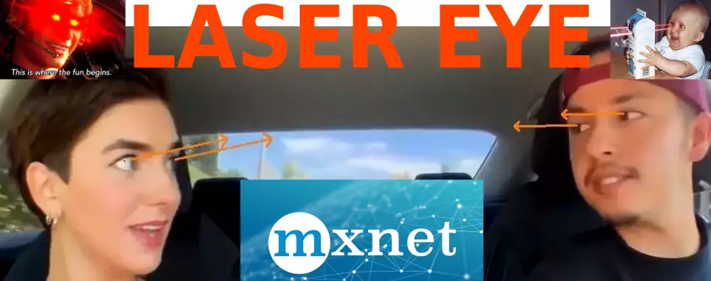

# Laser Eye : Gaze Estimation via Deep Neural Networks



## 运行方法（Easy Start）

* [安装Gstreamer (Install Gstreamer)](https://gstreamer.freedesktop.org/documentation/installing/on-linux.html?gi-language=c)
* 准备一个USB摄像机 (Prepare an usb camera)
* `chmod 755 ./run.sh`
* `./run.sh`

## Tips
* 在`demo.py`和`draw.py`中更改`FRAME_SHAPE`以编辑处理图像的大小
* 编辑`MxnetDetectionModel`的`scale`参数以设置合适的人脸检测器输入尺寸
* Change `FRAME_SHAPE` in `demo.py` and `draw.py` to edit the processing image size
* Edit`MxnetDetectionModel`'s `scale` parameter to make a suitable input size of face detector
* More details at [Wiki](https://github.com/1996scarlet/Laser-Eye/wiki)

## 一些结果（A Few Results）

<!--  -->


## 人脸检测 （Face Detection）
* [RetinaFace: Single-stage Dense Face Localisation in the Wild](https://arxiv.org/abs/1905.00641)
* [faster-mobile-retinaface (MobileNet Backbone)](https://github.com/1996scarlet/faster-mobile-retinaface)

## 特征点检测（Facial Landmarks Detection）
* MobileNet-v2 version (1.4MB, using by default)
* [Hourglass2(d=3)-CAB version (37MB)](https://github.com/deepinx/deep-face-alignment)

## 头部姿态估计（Head Pose Estimation）
* [head-pose-estimation](https://github.com/lincolnhard/head-pose-estimation)

## 虹膜分割（Iris Segmentation）
* [U-Net version (71KB, TVCG 2019)](https://ieeexplore.ieee.org/document/8818661)

## Citation

```
@article{wang2019realtime,
  title={Realtime and Accurate 3D Eye Gaze Capture with DCNN-based Iris and Pupil Segmentation},
  author={Wang, Zhiyong and Chai, Jinxiang and Xia, Shihong},
  journal={IEEE transactions on visualization and computer graphics},
  year={2019},
  publisher={IEEE}
}

@inproceedings{deng2019retinaface,
title={RetinaFace: Single-stage Dense Face Localisation in the Wild},
author={Deng, Jiankang and Guo, Jia and Yuxiang, Zhou and Jinke Yu and Irene Kotsia and Zafeiriou, Stefanos},
booktitle={arxiv},
year={2019}
}

@inproceedings{Jing2017Stacked,
  title={Stacked Hourglass Network for Robust Facial Landmark Localisation},
  author={Jing, Yang and Liu, Qingshan and Zhang, Kaihua and Jing, Yang and Liu, Qingshan and Zhang, Kaihua and Jing, Yang and Liu, Qingshan and Zhang, Kaihua},
  booktitle={IEEE Conference on Computer Vision & Pattern Recognition Workshops},
  year={2017},
}
```
